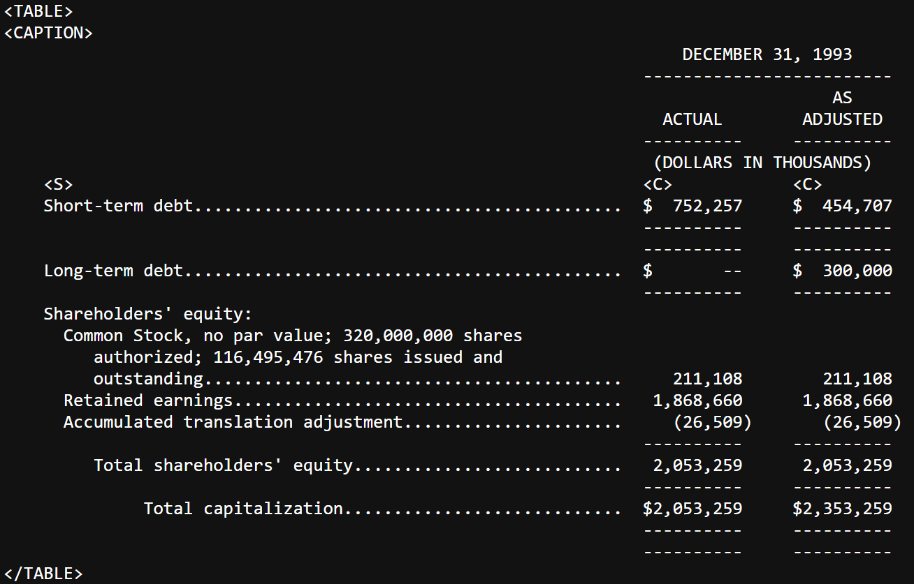

# SEC SGML (Not ready for use yet)

A python library to parse Securities and Exchange Commission [Standardized Generalized Markup Language](https://en.wikipedia.org/wiki/Standard_Generalized_Markup_Language).

Currently parses two types of files:
1. [Daily Archives](https://www.sec.gov/Archives/edgar/Feed/)
2. [Submissions](https://www.sec.gov/Archives/edgar/data/1318605/000095017022000796/0000950170-22-000796.txt)

Will be expanded to also parse:
1. [SGML Tables](https://www.sec.gov/Archives/edgar/data/320193/000089161894000021/0000891618-94-000021.txt)

